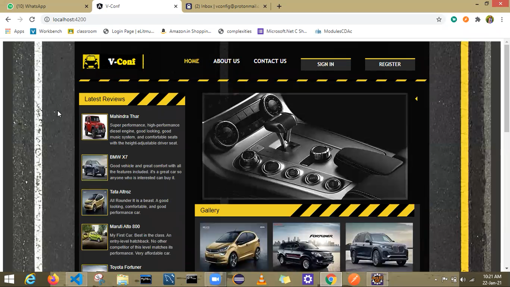
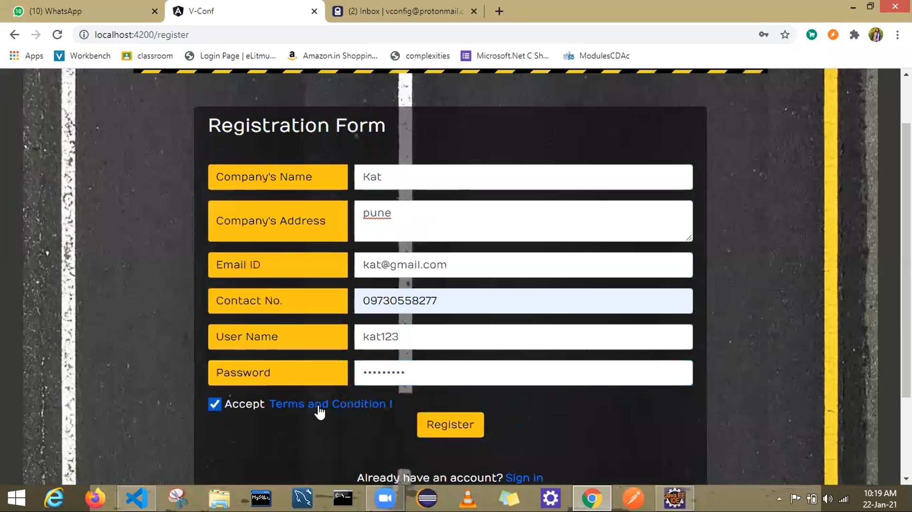
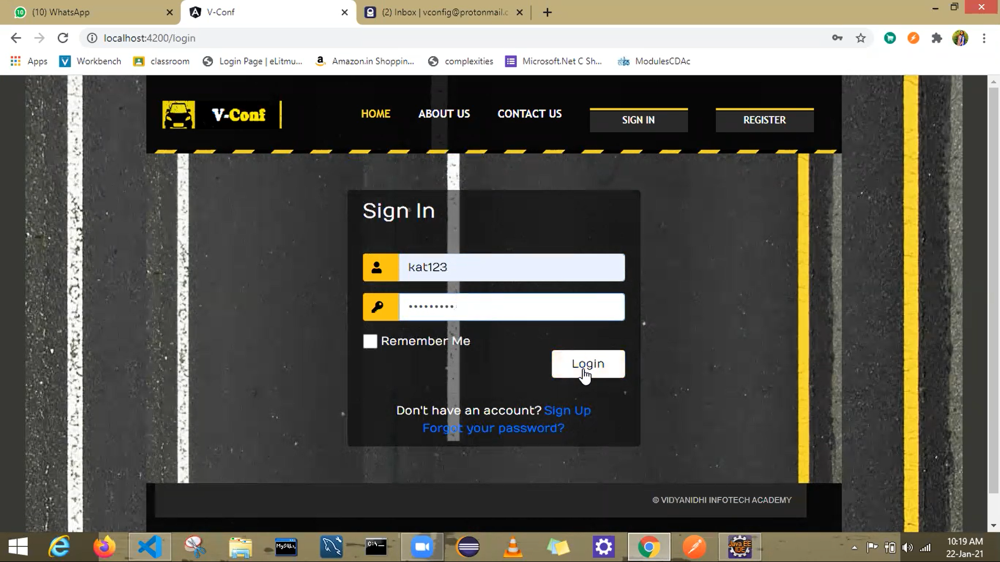
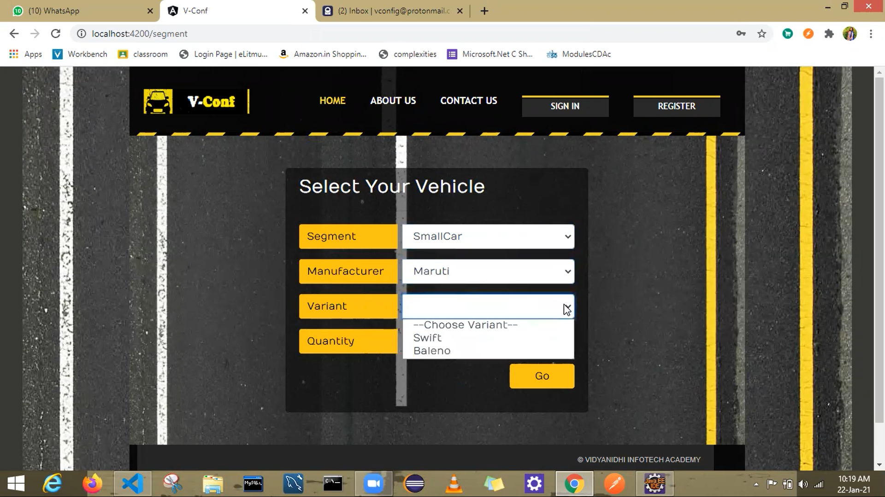
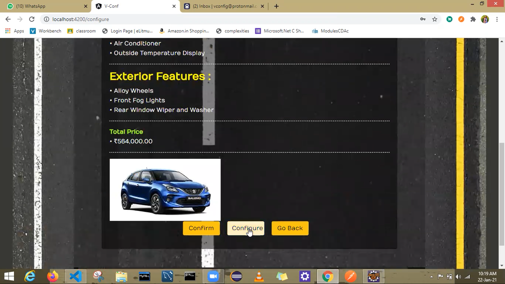
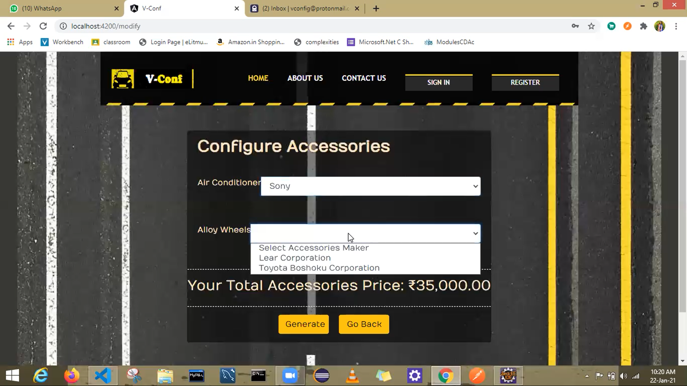
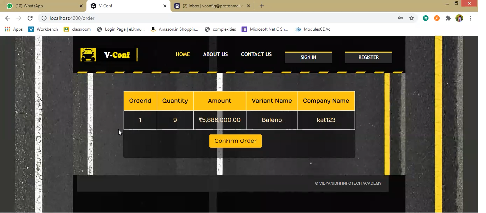
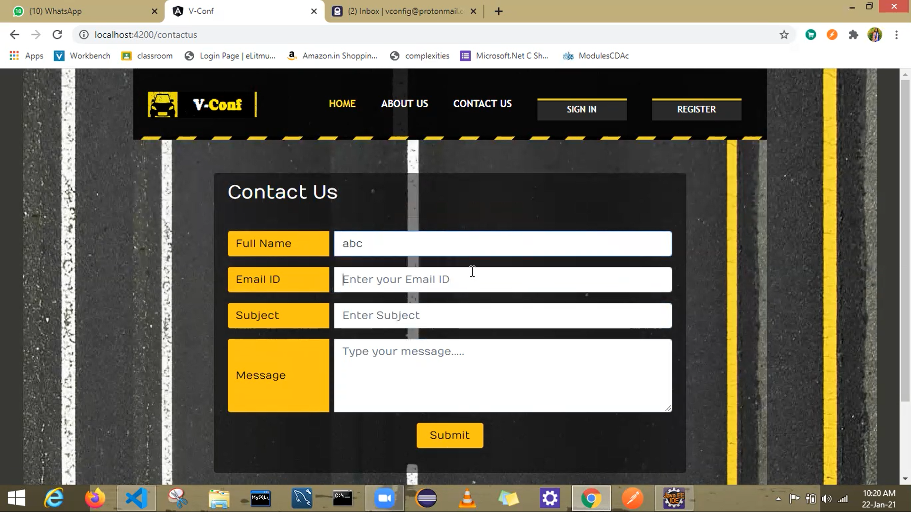
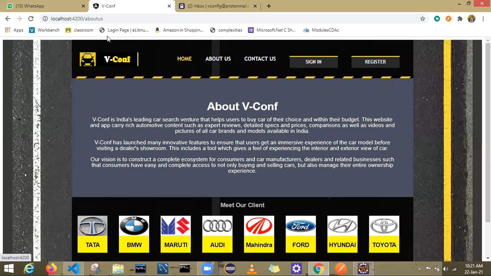

# vconf
Vehicle Configurator

### Description
It is a B2B portal using Angular7,Spring Restful API 5, Hibernate 5, Maven 3 and MySQL 8 designed for Car Leasing Company. Rental Car Companies will purchase the cars in lot and then provide those to their Customers. The website is completely database driven. It provides detailed specification about cars. It allows a user to select a car model, modify the configurable items (interior and exterior; such as body color, seats, music system etc.) & order the cars. Based on the configuration an invoice is generated in PDF and emailed to the client.

### Programming Languages
   

### Frameworks
  

## Database

### Integrated Development Environment (IDE) and Tools
    

### Screenshots

